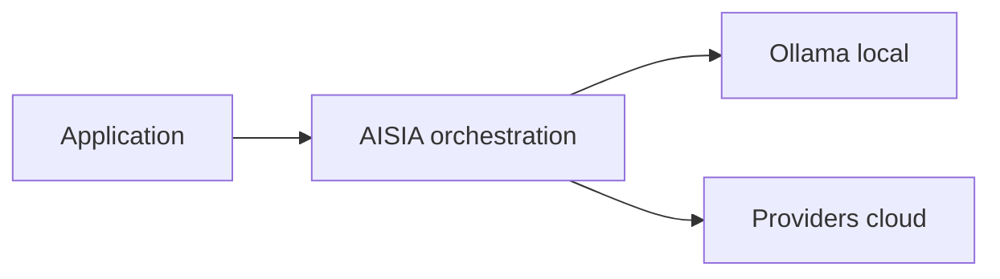

<!-- GENERATED:09_publications:start -->
<!--
  GÉNÉRÉ — ne pas éditer à la main.
  Source: scripts/generate/09_publications.py
  Régénérer: python3 scripts/aisia.py regen
  Gate deploy: python3 scripts/release/deploy.py <ver> --mode docs
-->

# terraform-aws-aisia

> **v6.12.37** — module registry — bootstrap AWS Swarm + substrat AISIA

## Cœur d'AISIA (identité produit)

AISIA est le **chef d'orchestre IA local-first** : une requête entre, le meilleur modèle (local ou cloud) exécute, la réponse sort traçable et gouvernée.

**Fonction première** : orchestrer chaque requête IA en **local-first** (Ollama sur cluster)
puis cloud si nécessaire — via `BanditRouter`, pas un simple reverse-proxy.

**Différenciation** : orchestration local-first — pas un proxy LLM stateless.

| vs proxy LLM | AISIA |
|--------------|-------|
| 1 provider fixe | **88** providers + **58** modèles locaux |
| Stateless | Qdrant + audit AI Act + multi-tenant |
| SaaS opaque | Déployable Swarm/K8s — **v6.12.37** LIVE |

Documentation : [README racine](../../../../README.md) ·
[Product Identity](../../../../specification/03-Project-State/Product-Identity-AISIA.md)




---
<!-- GENERATED:09_publications:end -->

## Architecture

```
VPC /16
  └─ Subnet public mono-AZ
       ├─ EC2 manager (docker swarm init, Traefik, worker-token)
       └─ EC2 worker × node_count (docker installé, join post-apply)
```

Security Group : SSH restreint + HTTP/HTTPS public + ports Swarm internes (VPC only).

## Usage

```hcl
provider "aws" {
  region = "eu-west-3"
}

module "aisia_aws_swarm" {
  source  = "app.terraform.io/AISIA/aisia/aws"
  version = "~> 1.0"

  org_id      = "acme"
  service_key = "C1"
  image_tag   = "v6.12.37"
  tier        = "saas"

  region          = "eu-west-3"
  node_count      = 2
  instance_flavor = "t3.large"
  ssh_public_key  = file("~/.ssh/id_rsa.pub")
}
```

**Post-apply** : récupérer le token Swarm et joindre les workers :
```bash
ssh ubuntu@$(tofu output -raw manager_ip) 'sudo cat /tmp/worker-token'
docker swarm join --token <TOKEN> <manager_private_ip>:2377
```

## Inputs

| Nom | Description | Type | Défaut | Requis |
|-----|-------------|------|--------|--------|
| `org_id` | Identifiant de l'organisation AISIA (tenant) | `string` | — | oui |
| `service_key` | Brique déployée (C1..C11) | `string` | — | oui |
| `runtime_kind` | edge \| compute \| compute-gpu \| data \| ops \| security | `string` | `"compute"` | non |
| `substrate` | Substrat cible (ce module = swarm) | `string` | `"swarm"` | non |
| `profile` | Profil de dimensionnement (S \| M \| L \| XL) | `string` | `"S"` | non |
| `node_count` | Nombre de workers Swarm (le manager est en plus) | `number` | `1` | non |
| `instance_flavor` | Type d'instance EC2 (manager + workers) | `string` | `"t3.large"` | non |
| `image_registry` | Registry des images AISIA | `string` | `"registry.aisia.fr"` | non |
| `image_tag` | Tag d'image AISIA à déployer | `string` | `"v6.12.37"` | non |
| `domain` | Domaine custom (vide = *.aisia.fr) | `string` | `""` | non |
| `tier` | Offre tarifaire (saas \| baas \| paas) | `string` | `"saas"` | non |
| `gpu_enabled` | Signal GPU — utiliser un instance_flavor GPU (g5.xlarge, p3.2xlarge) | `bool` | `false` | non |
| `region` | Région AWS (eu-west-3 = Paris, RGPD) | `string` | `"eu-west-3"` | non |
| `env` | Environnement pour tagging (prod \| staging \| dev) | `string` | `"prod"` | non |
| `cluster_name` | Préfixe des ressources AWS | `string` | `"aisia-swarm"` | non |
| `vpc_cidr` | CIDR du VPC (RFC1918) | `string` | `"10.40.0.0/16"` | non |
| `subnet_cidr` | CIDR du subnet public | `string` | `"10.40.1.0/24"` | non |
| `availability_zone` | AZ cible (vide = première AZ disponible) | `string` | `""` | non |
| `node_disk_size_gb` | Taille disque EBS root (GiB) | `number` | `50` | non |
| `ssh_public_key` | Clé publique SSH (OpenSSH). Vide = SSM uniquement | `string` | `""` | non |
| `ssh_allowed_cidr` | CIDR autorisé pour SSH. Restreindre en production | `string` | `"0.0.0.0/0"` | non |

## Outputs

| Nom | Description | Sensible |
|-----|-------------|----------|
| `region` | Région AWS du déploiement | non |
| `node_count` | Nombre de workers (hors manager) | non |
| `manager_ip` | IP publique du manager Swarm | non |
| `manager_private_ip` | IP privée du manager (advertise-addr) | non |
| `worker_ips` | IPs publiques des workers | non |
| `vpc_id` | ID du VPC créé | non |
| `subnet_id` | ID du subnet public | non |
| `security_group_id` | ID du Security Group Swarm | non |
| `swarm_join_token_path` | Chemin du token sur le manager | non |
| `swarm_join_command` | Gabarit de commande join | non |
| `endpoints` | Endpoints HTTP/HTTPS/API sur le manager | non |
| `next_steps` | Étapes post-apply (join workers + deploy stack) | non |

## Prérequis

- OpenTofu >= 1.7 ou Terraform >= 1.7
- Provider `hashicorp/aws ~> 5.0`
- Credentials AWS via env vars ou `~/.aws/credentials`
- Ports TCP 2377/7946 et UDP 7946/4789 ouverts entre nœuds (géré par le SG)

## Notes

- Le **join des workers** nécessite le token publié par le manager sur `/tmp/worker-token`
  après `docker swarm init`. Il n'est pas auto-joiné dans cette version (v1.0.0).
  Itération suivante : publication du token dans S3 SSE-KMS pour auto-join.
- `ssh_allowed_cidr = "0.0.0.0/0"` est le défaut pour faciliter les tests.
  **En production, restreindre à l'IP fixe admin.**
- Pour GPU : choisir un `instance_flavor` adapté (ex. `g5.xlarge` = 1x A10G,
  `p3.2xlarge` = 1x V100) et activer `gpu_enabled = true` pour signaler le besoin.

## Licence

[Mozilla Public License 2.0](LICENSE) — Copyright (c) 2026 AISIA (Sébastien Lambert).

## Référence des variables & sorties (auto-générée)

<!-- BEGIN_TF_DOCS -->
<!-- END_TF_DOCS -->

<!-- TF-MODULE-DOCS:09_publications -->
## Documentation AISIA

- **Documentation produit** : [aisia.fr/docs](https://aisia.fr/docs)
- **Référence API** : [api.aisia.fr/docs](https://api.aisia.fr/docs)
- **Provider Terraform** : [aisia-foundation/aisia](https://registry.terraform.io/providers/aisia-foundation/aisia/latest/docs)
- **Guide d'implémentation** : [getting-started](https://registry.terraform.io/providers/aisia-foundation/aisia/latest/docs/guides/getting-started)
- **Version LIVE** : **v6.12.37**
